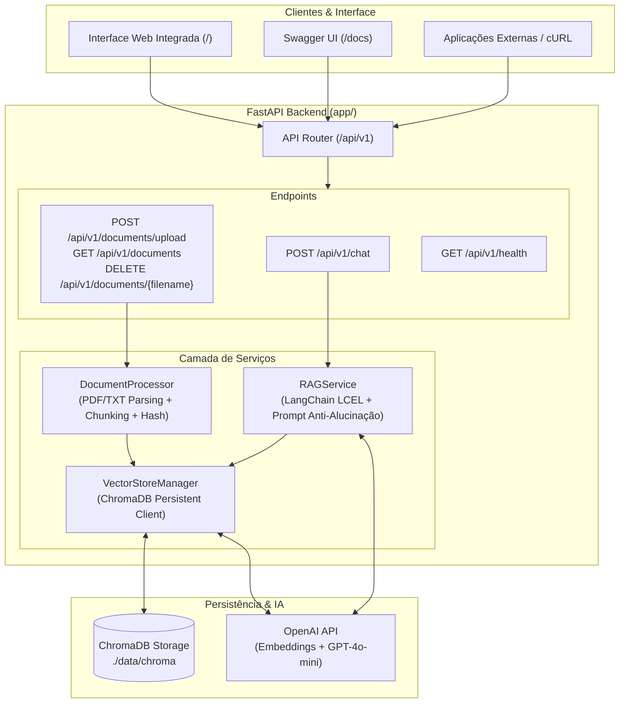

# 🧠 Assistente IA com RAG (Retrieval-Augmented Generation)

> **Chat inteligente que responde perguntas com base em documentos enviados (PDFs, textos). Integra LLMs (DeepSeek / OpenAI), embeddings locais/nuvem e busca vetorial com LangChain, ChromaDB e FastAPI.**

[](https://www.python.org/)
[](https://fastapi.tiangolo.com/)
[](https://www.langchain.com/)
[](https://www.trychroma.com/)
[](https://www.deepseek.com/)
[](https://www.docker.com/)

---

## 📋 Sumário
- [Visão Geral](#-visão-geral)
- [Arquitetura do Sistema](#-arquitetura-do-sistema)
- [Estrutura de Pastas](#-estrutura-de-pastas)
- [Instalação e Execução Local](#-instalação-e-execução-local)
- [Executando com Docker e Docker Compose](#-executando-com-docker-e-docker-compose)
- [Endpoints da API REST](#-endpoints-da-api-rest)
- [Interface Web Integrada](#-interface-web-integrada)
- [Variáveis de Ambiente](#-variáveis-de-ambiente)
- [Executando a Suíte de Testes](#-executando-a-suíte-de-testes)

---

## 🎯 Visão Geral

Este projeto é uma solução completa para construir bases de conhecimento baseadas em documentos e consultar informações através de modelos de inteligência artificial de forma estritamente fundamentada e sem alucinações.

### Principais Recursos:
- **Ingestão Multi-formato**: Suporte nativo para arquivos PDF (com rastreamento de número de página), TXT, Markdown (.md), CSV e JSON.
- **Divisão Inteligente (Chunking)**: Segmentação semântica com sobreposição controlada (`RecursiveCharacterTextSplitter`) e hashing SHA-256 para evitar duplicações.
- **Banco Vetorial Persistente**: Armazenamento local e persistente de embeddings com **ChromaDB**.
- **Orquestração RAG & Anti-Alucinação**: LangChain LCEL com prompts rigorosos que instruem o modelo a responder exclusivamente com base no contexto fornecido, indicando fontes e páginas consultadas.
- **API REST Assíncrona**: Desenvolvida com **FastAPI**, com documentação interativa automática (Swagger UI / OpenAPI).
- **Interface Gráfica Embutida**: Painel web responsivo (Vanilla HTML/CSS/JS) com drag-and-drop de arquivos e chat em tempo real.
- **Pronto para Produção**: Containerização com **Docker** e **Docker Compose** com volumes persistentes.

---

## 🏗 Arquitetura do Sistema



---

## 📁 Estrutura de Pastas

```
Assistente IA com RAG/
├── app/
│   ├── __init__.py
│   ├── main.py                  # Inicialização do FastAPI, CORS, rotas e estáticos
│   ├── core/
│   │   ├── config.py            # Configurações com Pydantic Settings
│   │   └── logging.py           # Logging padronizado
│   ├── schemas/
│   │   ├── chat.py              # Modelos Pydantic para requisição e resposta do Chat
│   │   ├── document.py          # Modelos para upload e listagem de documentos
│   │   └── health.py            # Modelos para checagem de integridade
│   ├── services/
│   │   ├── document_processor.py# Extração de texto de PDF/TXT e chunking
│   │   ├── vector_store.py      # Operações de banco vetorial no ChromaDB
│   │   └── rag_service.py       # Cadeia RAG LangChain e montagem de prompts
│   ├── api/
│   │   └── v1/
│   │       ├── api.py           # Agregador de rotas v1
│   │       └── endpoints/
│   │           ├── chat.py      # POST /api/v1/chat
│   │           ├── documents.py # Upload, listagem e exclusão de documentos
│   │           └── health.py    # GET /api/v1/health
│   └── static/                  # Interface Web Integrada
│       ├── index.html           # Página principal com chat e upload
│       ├── style.css            # Estilos modernos e responsivos
│       └── app.js               # Lógica cliente assíncrona
├── data/
│   ├── chroma/                  # Diretório de persistência do ChromaDB
│   └── uploads/                 # Arquivos temporários de upload
├── tests/
│   ├── conftest.py              # Fixtures com mocks de OpenAI e Chroma temporário
│   ├── test_document_processor.py # Testes de parsing e segmentação
│   ├── test_vector_store.py     # Testes do banco vetorial
│   ├── test_rag_service.py      # Testes da lógica RAG
│   └── test_api.py              # Testes de integração dos endpoints REST
├── Dockerfile                   # Build da imagem Docker (Python 3.11 slim)
├── docker-compose.yml           # Orquestração de containers com volumes
├── requirements.txt             # Dependências do projeto
├── pyproject.toml               # Configurações do projeto e do pytest
├── .env.example                 # Modelo de variáveis de ambiente
└── README.md                    # Documentação do projeto
```

---

## 🚀 Instalação e Execução Local

### 1. Pré-requisitos
- Python 3.10 ou superior instalado
- Chave de API da OpenAI ([obter aqui](https://platform.openai.com/api-keys))

### 2. Clonar / Acessar o Diretório do Projeto
```bash
cd "C:\Users\User\Documents\Projetos\Assistente IA com RAG"
```

### 3. Criar e Ativar o Ambiente Virtual
**No Windows (PowerShell):**
```powershell
python -m venv venv
.\venv\Scripts\Activate.ps1
```

**No Linux/macOS:**
```bash
python3 -m venv venv
source venv/bin/activate
```

### 4. Instalar Dependências
```bash
pip install --upgrade pip
pip install -r requirements.txt
```

### 5. Configurar as Variáveis de Ambiente
Crie um arquivo `.env` na raiz a partir do `.env.example`:
```bash
cp .env.example .env
```
Edite o arquivo `.env` e insira sua chave da OpenAI:
```env
OPENAI_API_KEY=sk-proj-sua-chave-aqui
OPENAI_MODEL=gpt-4o-mini
EMBEDDING_MODEL=text-embedding-3-small
```

### 6. Executar o Servidor FastAPI
```bash
uvicorn app.main:app --reload --host 0.0.0.0 --port 8000
```

- **Interface Web**: Acesse [http://localhost:8000](http://localhost:8000)
- **Documentação Swagger (OpenAPI)**: Acesse [http://localhost:8000/docs](http://localhost:8000/docs)
- **Documentação ReDoc**: Acesse [http://localhost:8000/redoc](http://localhost:8000/redoc)

---

## 🐳 Executando com Docker e Docker Compose

Para rodar a aplicação em um ambiente totalmente isolado e containerizado:

### 1. Configurar o `.env`
Certifique-se de que a variável `OPENAI_API_KEY` está preenchida no arquivo `.env`.

### 2. Iniciar os Containers
```bash
docker-compose up --build -d
```

### 3. Verificar Logs e Status
```bash
docker-compose logs -f
```

### 4. Parar os Containers
```bash
docker-compose down
```

> **Nota de Persistência**: A pasta `./data/chroma` é mapeada como volume no Docker, garantindo que todos os documentos indexados permaneçam salvos mesmo ao reiniciar os containers.

---

## 📡 Endpoints da API REST

### 1. `GET /api/v1/health`
Verifica a integridade da aplicação e o status de conexão com o banco vetorial.

```bash
curl -X GET "http://localhost:8000/api/v1/health"
```

**Resposta de Exemplo:**
```json
{
  "status": "ok",
  "version": "1.0.0",
  "vector_store_status": "connected",
  "total_indexed_chunks": 42
}
```

---

### 2. `POST /api/v1/documents/upload`
Faz o upload de um arquivo PDF, TXT ou Markdown, processa em chunks com metadados e indexa no ChromaDB.

```bash
curl -X POST "http://localhost:8000/api/v1/documents/upload" \
  -F "file=@/caminho/do/seu/documento.pdf"
```

**Resposta de Exemplo:**
```json
{
  "filename": "documento.pdf",
  "file_type": "pdf",
  "total_chunks": 15,
  "document_hash": "e3b0c44298fc1c149afbf4c8996fb92427ae41e4649b934ca495991b7852b855",
  "message": "Documento 'documento.pdf' processado e indexado com sucesso (15 chunks gerados)."
}
```

---

### 3. `GET /api/v1/documents`
Lista todos os documentos indexados na base vetorial e a quantidade de chunks por arquivo.

```bash
curl -X GET "http://localhost:8000/api/v1/documents"
```

**Resposta de Exemplo:**
```json
{
  "total_documents": 2,
  "total_chunks": 25,
  "documents": [
    {
      "filename": "documento.pdf",
      "chunks_count": 15,
      "pages": [1, 2, 3, 4]
    },
    {
      "filename": "notas.txt",
      "chunks_count": 10,
      "pages": [1]
    }
  ]
}
```

---

### 4. `POST /api/v1/chat`
Envia uma pergunta ao assistente RAG. O sistema busca os chunks mais relevantes e retorna a resposta contextualizada com as fontes citadas.

```bash
curl -X POST "http://localhost:8000/api/v1/chat" \
  -H "Content-Type: application/json" \
  -d '{
    "query": "Quais são as principais cláusulas descritas no contrato?",
    "history": [],
    "top_k": 4
  }'
```

**Resposta de Exemplo:**
```json
{
  "answer": "De acordo com o documento contrato.pdf (Página 2), as principais cláusulas incluem...",
  "sources": [
    {
      "content": "Trecho textual recuperado do documento...",
      "source": "contrato.pdf",
      "page": 2,
      "chunk_id": 3,
      "score": 0.1824
    }
  ],
  "sources_count": 1,
  "model_used": "gpt-4o-mini",
  "execution_time_ms": 782.45
}
```

---

### 5. `DELETE /api/v1/documents/{filename}`
Exclui todos os chunks associados a um arquivo específico da base vetorial.

```bash
curl -X DELETE "http://localhost:8000/api/v1/documents/documento.pdf"
```

---

## 💻 Interface Web Integrada

Ao acessar `http://localhost:8000/`, você tem acesso imediato a uma interface visual completa:

1. **Painel Lateral Esquerdo**:
   - Área de **Drag & Drop** para upload instantâneo de múltiplos arquivos.
   - Lista em tempo real de documentos indexados com opção de exclusão individual.
   - Indicador de integridade do sistema e total de chunks armazenados no ChromaDB.
2. **Painel Central de Chat**:
   - Campo de entrada com auto-ajuste de altura e suporte a `Shift+Enter`.
   - Balões de conversa elegantes com formatação Markdown e blocos de código.
   - Painel retrátil **"Fontes Citadas"** para auditar a procedência de cada resposta.
   - Botão para limpar histórico da sessão.

---

## ⚙️ Variáveis de Ambiente
 
| Variável | Padrão | Descrição |
| :--- | :--- | :--- |
| `LLM_PROVIDER` | `deepseek` | Provedor de LLM padrão (`deepseek` ou `openai`) |
| `DEEPSEEK_API_KEY` | *(Obrigatório p/ DeepSeek)* | Chave de API da DeepSeek ([obter aqui](https://platform.deepseek.com/)) |
| `DEEPSEEK_MODEL` | `deepseek-chat` | Modelo DeepSeek (ex: `deepseek-chat`, `deepseek-reasoner`) |
| `DEEPSEEK_BASE_URL` | `https://api.deepseek.com` | URL base da API da DeepSeek |
| `EMBEDDING_PROVIDER` | `huggingface` | Provedor de vetores: `huggingface` (local gratuito) ou `openai` |
| `EMBEDDING_MODEL` | `sentence-transformers/all-MiniLM-L6-v2` | Modelo de embeddings vetoriais |
| `OPENAI_API_KEY` | *(Opcional)* | Chave de API da OpenAI (se `LLM_PROVIDER=openai`) |
| `OPENAI_MODEL` | `gpt-4o-mini` | Modelo LLM alternativo OpenAI |
| `TEMPERATURE` | `0.0` | Temperatura do modelo (0.0 para respostas factuais e precisas) |
| `CHROMA_PERSIST_DIR` | `./data/chroma` | Caminho de persistência local do ChromaDB |
| `COLLECTION_NAME` | `rag_documents` | Nome da coleção no ChromaDB |
| `CHUNK_SIZE` | `1000` | Tamanho máximo em caracteres de cada chunk |
| `CHUNK_OVERLAP` | `200` | Sobreposição em caracteres entre chunks vizinhos |
| `TOP_K_RESULTS` | `4` | Quantidade de chunks mais relevantes recuperados por busca |
| `DEBUG` | `false` | Ativa logs detalhados de depuração |
| `HOST` | `0.0.0.0` | Host de escuta do servidor FastAPI |
| `PORT` | `8000` | Porta de escuta do servidor FastAPI |

---

## 🧪 Executando a Suíte de Testes

Os testes automatizados foram construídos com **pytest** e utilizam mocks determinísticos para ChromaDB e OpenAI, permitindo execução rápida e 100% offline.

```bash
pytest -v
```

Para rodar com relatório de cobertura:
```bash
pytest --cov=app tests/
```
